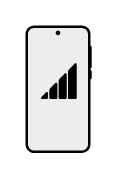

# Mobile Network

## Definition

```
{
  _style: { 
    entity: 'shape=mxgraph.networks2.icon;aspect=fixed;fillColor=#EDEDED;strokeColor=#000000;gradientColor=#5B6163;network2IconShadow=1;network2bgFillColor=none;network2Icon=mxgraph.networks2.mobile_network;network2IconXOffset=0.0049;network2IconW=0.5297;network2IconH=1.02;',
  },
  _original_width: 26.484999999999996,
  _original_height: 51,
}
```

## Usage

```
import { MobileNetwork } from '@dinghy/standard-components-diagrams/network2'

<MobileNetwork/>
```

## Preview


