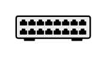

# Patch Panel

## Definition

```
{
  _style: 'shape=mxgraph.networks2.icon;aspect=fixed;fillColor=#EDEDED;strokeColor=#000000;gradientColor=#5B6163;network2IconShadow=1;network2bgFillColor=none;network2Icon=mxgraph.networks2.patch_panel;network2IconXOffset=0.0001;network2IconYOffset=-0.0211;network2IconW=1;network2IconH=0.3359;',
  _width: 50,
  _height: 16.794999999999998,
}
```

## Usage

```
import { PatchPanel } from '@reactiac/standard-components-diagrams/network2'

<PatchPanel/>
```

## Preview


