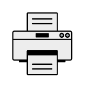

# Printer

## Definition

```
{
  _style: 'fillColorStyles=neutralFill;neutralFill=#9DA6A8;shape=mxgraph.networks2.icon;aspect=fixed;fillColor=#EDEDED;strokeColor=#000000;gradientColor=#5B6163;network2IconShadow=1;network2bgFillColor=none;network2Icon=mxgraph.networks2.printer;network2IconW=1;network2IconH=1.04;',
  _width: 50,
  _height: 52,
}
```

## Usage

```
import { Printer } from '@reactiac/standard-components-diagrams/network2'

<Printer/>
```

## Preview


