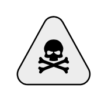

# Threat

## Definition

```
{
  _style: 'shape=mxgraph.networks2.icon;aspect=fixed;fillColor=#EDEDED;strokeColor=#000000;gradientColor=#5B6163;network2IconShadow=1;network2bgFillColor=none;network2Icon=mxgraph.networks2.threat;network2IconYOffset=-0.0472;network2IconW=1.0625;network2IconH=0.9583;',
  _width: 53.125,
  _height: 47.915,
}
```

## Usage

```
import { Threat } from '@reactiac/standard-components-diagrams/network2'

<Threat/>
```

## Preview


