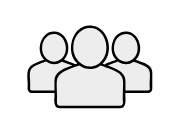

# Users

## Definition

```
{
  _style: { 
    entity: 'shape=mxgraph.networks2.icon;aspect=fixed;fillColor=#EDEDED;strokeColor=#000000;gradientColor=#5B6163;network2IconShadow=1;network2bgFillColor=none;network2Icon=mxgraph.networks2.users;network2IconXOffset=0.0019;network2IconYOffset=-0.0004;network2IconW=1.0353;network2IconH=0.6623;',
  },
  _original_width: 51.76500000000001,
  _original_height: 33.115,
}
```

## Usage

```
import { Users } from '@dinghy/standard-components-diagrams/network2'

<Users/>
```

## Preview


