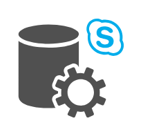

# Office Communications Entities

- [Component3rdPartyCallCenterSolution](./component-3rd-party-call-center-solution.md)  

- [Component3rdPartyIntegration](./component-3rd-party-integration.md)  

- [Component3rdPartyService](./component-3rd-party-service.md)  

- [ApplicationSharingWorkload](./application-sharing-workload.md)  

- [AudioConferencingApplication](./audio-conferencing-application.md)  

- [CentralManagementService](./central-management-service.md)  

- [ChatRoom](./chat-room.md)  

- [ConferenceAnnouncementService](./conference-announcement-service.md)  

- [DisconnectedMailbox](./disconnected-mailbox.md)  

- [DiscoverySearchMailbox](./discovery-search-mailbox.md)  

- [DynamicDistributionGroup](./dynamic-distribution-group.md)  

- [EdgeSubscription](./edge-subscription.md)  

- [EmailWorkloaad](./email-workloaad.md)  

- [EquipmentMailbox](./equipment-mailbox.md)  

- [ExchangeActiveSync](./exchange-active-sync.md)  

- [ExchangeActiveSyncBlue](./exchange-active-sync-blue.md)  

- [FaxPartner](./fax-partner.md)  

- [GlobalAddressList](./global-address-list.md)  

- [HybridVoipGateway](./hybrid-voip-gateway.md)  

- [ImWorkload](./im-workload.md)  

- [JournalingRule](./journaling-rule.md)  

- [LocalMoveRequest](./local-move-request.md)  

- [LyncControlPanel](./lync-control-panel.md)  

- [LyncPhoneEdition](./lync-phone-edition.md)  

- [LyncRoomSystem](./lync-room-system.md)  

- [LyncServerManagementTool](./lync-server-management-tool.md)  

- [LyncStorageService](./lync-storage-service.md)  

- [LyncWebAppClient](./lync-web-app-client.md)  

- [MailEnabledPublicFolder](./mail-enabled-public-folder.md)  

- [MailboxAssistant](./mailbox-assistant.md)  

- [MessagesQueued](./messages-queued.md)  

- [OfflineAddressBook](./offline-address-book.md)  

- [PersonalArchiveMailbox](./personal-archive-mailbox.md)  

- [PublicImCloudService](./public-im-cloud-service.md)  

- [PushNotificationService](./push-notification-service.md)  

- [QueueViewer](./queue-viewer.md)  

- [RemoteMailbox](./remote-mailbox.md)  

- [RemoteMoveRequest](./remote-move-request.md)  

- [ResponseGroup](./response-group.md)  

- [RoomMailbox](./room-mailbox.md)  

- [SharedMailbox](./shared-mailbox.md)  

- [SipUriUmDialPlan](./sip-uri-um-dial-plan.md)  

- [SiteMailbox](./site-mailbox.md)  

- [SkypeForBusinessControlPanel](./skype-for-business-control-panel.md)  

- [SkypeForBusinessPhoneEdition](./skype-for-business-phone-edition.md)  

- [SkypeForBusinessRoomSystem](./skype-for-business-room-system.md)  

- [SkypeForBusinessServerManagementTool](./skype-for-business-server-management-tool.md)  

- [SkypeForBusinessStorageService](./skype-for-business-storage-service.md)  

- [SkypeForBusinessWebAppClient](./skype-for-business-web-app-client.md)  

- [SmsGateway](./sms-gateway.md)  

- [SmtpConnector](./smtp-connector.md)  

- [SystemMailbox](./system-mailbox.md)  

- [TdmPbx](./tdm-pbx.md)  

- [TelephoneExtensionDialPlan](./telephone-extension-dial-plan.md)  

- [TransportRule](./transport-rule.md)  

- [UcmaApplication](./ucma-application.md)  

- [UcwaApplication](./ucwa-application.md)  

- [UmAutoAttendant](./um-auto-attendant.md)  

- [UmDialPlanE164](./um-dial-plan-e164.md)  

- [UmDialPlanSecondary](./um-dial-plan-secondary.md)  

- [UmEnabledMailbox](./um-enabled-mailbox.md)  

- [UmHuntGroup](./um-hunt-group.md)  

- [UmIpGateway](./um-ip-gateway.md)  

- [UserMailbox](./user-mailbox.md)  

- [VideoWorkload](./video-workload.md)  

- [VoiceMailPreview](./voice-mail-preview.md)  

- [VoiceWorkload](./voice-workload.md)  

- [VoipGateway](./voip-gateway.md)  

- [WatcherNode](./watcher-node.md)  

- [XmppService](./xmpp-service.md)  

