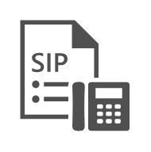

# SIP URI UM Dial Plan

## Definition

```
{
  _style: 'sketch=0;pointerEvents=1;shadow=0;dashed=0;html=1;strokeColor=none;fillColor=#505050;labelPosition=center;verticalLabelPosition=bottom;verticalAlign=top;outlineConnect=0;align=center;shape=mxgraph.office.communications.sip_uri_um_dial_plan;',
  _width: 55,
  _height: 56,
}
```

## Usage

```
import { SipUriUmDialPlan } from '@diac/standard-components-diagrams/officeCommunications'

<SipUriUmDialPlan/>
```

## Preview


