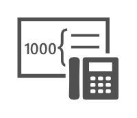

# UM Hunt Group

## Definition

```
{
  _style: 'sketch=0;pointerEvents=1;shadow=0;dashed=0;html=1;strokeColor=none;fillColor=#505050;labelPosition=center;verticalLabelPosition=bottom;verticalAlign=top;outlineConnect=0;align=center;shape=mxgraph.office.communications.um_hunt_group;',
  _width: 59,
  _height: 48,
}
```

## Usage

```
import { UmHuntGroup } from '@reactiac/standard-components-diagrams/officeCommunications'

<UmHuntGroup/>
```

## Preview


