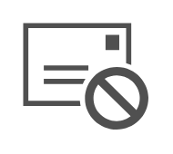

# Anti-Spam

## Definition

```
{
  _style: 'sketch=0;pointerEvents=1;shadow=0;dashed=0;html=1;strokeColor=none;fillColor=#505050;labelPosition=center;verticalLabelPosition=bottom;verticalAlign=top;outlineConnect=0;align=center;shape=mxgraph.office.concepts.anti_spam;',
  _width: 55,
  _height: 47,
}
```

## Usage

```
import { AntiSpam } from '@reactiac/standard-components-diagrams/officeConcepts'

<AntiSpam/>
```

## Preview


