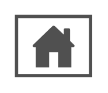

# Home Page

## Definition

```
{
  _style: { 
    entity: 'sketch=0;pointerEvents=1;shadow=0;dashed=0;html=1;strokeColor=none;fillColor=#505050;labelPosition=center;verticalLabelPosition=bottom;verticalAlign=top;outlineConnect=0;align=center;shape=mxgraph.office.concepts.home_page;',
  },
  _width: 53,
  _height: 43,
}
```

## Usage

```
import { HomePage } from '@diac/standard-components-diagrams/officeConcepts'

<HomePage/>
```

## Preview


