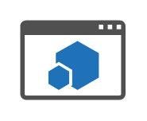
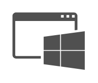
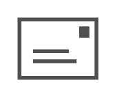

# Office Concepts Entities

- [AddressBook](./address-book.md)  

- [AntiSpam](./anti-spam.md)  

- [AppForOffice](./app-for-office.md)  

- [AppForSharepoint](./app-for-sharepoint.md)  

- [AppPart](./app-part.md)  

- [ApplicationAndroid](./application-android.md)  

- [ApplicationGeneric](./application-generic.md)  

- [ApplicationHybrid](./application-hybrid.md)  

- [ApplicationIos](./application-ios.md)  

- [ApplicationWeb](./application-web.md)  

- [ApplicationWindows](./application-windows.md)  

- [Archive](./archive.md)  

- [Attachment](./attachment.md)  

- [BackupLocal](./backup-local.md)  

- [BackupOnline](./backup-online.md)  

- [Bandwidth](./bandwidth.md)  

- [BandwidthCalculator](./bandwidth-calculator.md)  

- [BestPractices](./best-practices.md)  

- [BookJournal](./book-journal.md)  

- [Calculator](./calculator.md)  

- [Calendar](./calendar.md)  

- [Clipboard](./clipboard.md)  

- [Clock](./clock.md)  

- [Column](./column.md)  

- [Connector](./connector.md)  

- [Contacts](./contacts.md)  

- [ContentType](./content-type.md)  

- [CreditCard](./credit-card.md)  

- [Document](./document.md)  

- [DocumentBlank](./document-blank.md)  

- [DocumentShared](./document-shared.md)  

- [Documents](./documents.md)  

- [DocumentsShared](./documents-shared.md)  

- [Download](./download.md)  

- [Email](./email.md)  

- [EmailApproved](./email-approved.md)  

- [EmailExpired](./email-expired.md)  

- [EmailRejected](./email-rejected.md)  

- [FileKey](./file-key.md)  

- [Firewall](./firewall.md)  

- [FirewallBlue](./firewall-blue.md)  

- [FirewallGhosted](./firewall-ghosted.md)  

- [FirewallGreen](./firewall-green.md)  

- [FirewallOrange](./firewall-orange.md)  

- [Folder](./folder.md)  

- [FolderBlue](./folder-blue.md)  

- [FolderGhosted](./folder-ghosted.md)  

- [FolderGreen](./folder-green.md)  

- [FolderOrange](./folder-orange.md)  

- [FolderOpen](./folder-open.md)  

- [FolderPublic](./folder-public.md)  

- [FolderShared](./folder-shared.md)  

- [Folders](./folders.md)  

- [Form](./form.md)  

- [GetStarted](./get-started.md)  

- [GlobeInternet](./globe-internet.md)  

- [Help](./help.md)  

- [Home](./home.md)  

- [HomeBlue](./home-blue.md)  

- [HomeGhosted](./home-ghosted.md)  

- [HomeGreen](./home-green.md)  

- [HomeOrange](./home-orange.md)  

- [HomePage](./home-page.md)  

- [HomePageBlue](./home-page-blue.md)  

- [HomePageGhosted](./home-page-ghosted.md)  

- [HomePageGreen](./home-page-green.md)  

- [HomePageOrange](./home-page-orange.md)  

- [Hybrid](./hybrid.md)  

- [InputOutputFilter](./input-output-filter.md)  

- [Install](./install.md)  

- [Integration](./integration.md)  

- [Lab](./lab.md)  

- [Learn](./learn.md)  

- [License](./license.md)  

- [Link](./link.md)  

- [ListLibrary](./list-library.md)  

- [Mailbox](./mailbox.md)  

- [Mailbox2](./mailbox-2.md)  

- [Maintenance](./maintenance.md)  

- [MarketplaceShoppingBag](./marketplace-shopping-bag.md)  

- [MeetsRequirements](./meets-requirements.md)  

- [Migration](./migration.md)  

- [Moes](./moes.md)  

- [Navigation](./navigation.md)  

- [NodeGeneric](./node-generic.md)  

- [NodeGenericBlue](./node-generic-blue.md)  

- [NodeGenericGhosted](./node-generic-ghosted.md)  

- [NodeGenericGreen](./node-generic-green.md)  

- [NodeGenericOrange](./node-generic-orange.md)  

- [OfficeInstalled](./office-installed.md)  

- [OnPremises](./on-premises.md)  

- [OnPremisesDirectory](./on-premises-directory.md)  

- [Phishing](./phishing.md)  

- [Pin](./pin.md)  

- [PlatformOptions](./platform-options.md)  

- [Powershell](./powershell.md)  

- [Properties](./properties.md)  

- [Publish](./publish.md)  

- [RemoteAccess](./remote-access.md)  

- [Script](./script.md)  

- [Search](./search.md)  

- [ServiceApplication](./service-application.md)  

- [Settings](./settings.md)  

- [SettingsOffice365](./settings-office-365.md)  

- [SignUp](./sign-up.md)  

- [SoundFile](./sound-file.md)  

- [Tasks](./tasks.md)  

- [TechnicalDiagram](./technical-diagram.md)  

- [UpgradeApplication](./upgrade-application.md)  

- [UpgradeServer](./upgrade-server.md)  

- [UpgradeSite](./upgrade-site.md)  

- [Upload](./upload.md)  

- [VideoForm](./video-form.md)  

- [VideoPlay](./video-play.md)  

- [Voicemail](./voicemail.md)  

- [VoicemailPreview](./voicemail-preview.md)  

- [Walkthrough](./walkthrough.md)  

- [WebConferencing](./web-conferencing.md)  

- [WebPage](./web-page.md)  

- [WebPart](./web-part.md)  

- [WebServices](./web-services.md)  

- [Website](./website.md)  

- [WhatsNew](./whats-new.md)  

- [WritingPen](./writing-pen.md)  

- [WritingPencil](./writing-pencil.md)  

