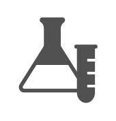

# Lab

## Definition

```
{
  _style: { 
    entity: 'sketch=0;pointerEvents=1;shadow=0;dashed=0;html=1;strokeColor=none;fillColor=#505050;labelPosition=center;verticalLabelPosition=bottom;verticalAlign=top;outlineConnect=0;align=center;shape=mxgraph.office.concepts.lab;',
  },
  _original_width: 47,
  _original_height: 50,
}
```

## Usage

```
import { Lab } from '@diac/standard-components-diagrams/officeConcepts'

<Lab/>
```

## Preview


