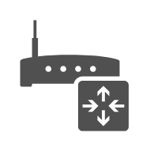

# Router

## Definition

```
{
  _style: { 
    entity: 'sketch=0;pointerEvents=1;shadow=0;dashed=0;html=1;strokeColor=none;fillColor=#505050;labelPosition=center;verticalLabelPosition=bottom;verticalAlign=top;outlineConnect=0;align=center;shape=mxgraph.office.devices.router;',
  },
  _width: 55,
  _height: 56,
}
```

## Usage

```
import { Router } from '@diac/standard-components-diagrams/officeDevices'

<Router/>
```

## Preview


