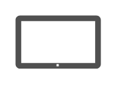

# Tablet, Windows 8

## Definition

```
{
  _style: 'sketch=0;pointerEvents=1;shadow=0;dashed=0;html=1;strokeColor=none;fillColor=#505050;labelPosition=center;verticalLabelPosition=bottom;verticalAlign=top;outlineConnect=0;align=center;shape=mxgraph.office.devices.tablet_windows_8;',
  _width: 56,
  _height: 35,
}
```

## Usage

```
import { TabletWindows8 } from '@reactiac/standard-components-diagrams/officeDevices'

<TabletWindows8/>
```

## Preview


