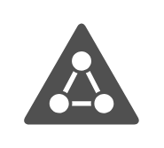

# Office Security Entities

- [ActiveDirectory](./active-directory.md)  

- [AddressBookPolicies](./address-book-policies.md)  

- [Certificate](./certificate.md)  

- [Credentials](./credentials.md)  

- [Domain](./domain.md)  

- [EmailAddressPolicy](./email-address-policy.md)  

- [FederationService](./federation-service.md)  

- [FederationTrust](./federation-trust.md)  

- [IrmProtectedMessage](./irm-protected-message.md)  

- [KeyPermissions](./key-permissions.md)  

- [KeyPermissionsBlue](./key-permissions-blue.md)  

- [KeyPermissionsGhosted](./key-permissions-ghosted.md)  

- [KeyPermissionsGreen](./key-permissions-green.md)  

- [KeyPermissionsOrange](./key-permissions-orange.md)  

- [LockWithKeySecurity](./lock-with-key-security.md)  

- [LockWithKeySecurityBlue](./lock-with-key-security-blue.md)  

- [LockWithKeySecurityGhosted](./lock-with-key-security-ghosted.md)  

- [LockWithKeySecurityGreen](./lock-with-key-security-green.md)  

- [LockWithKeySecurityOrange](./lock-with-key-security-orange.md)  

- [LockProtected](./lock-protected.md)  

- [LockProtectedBlue](./lock-protected-blue.md)  

- [LockProtectedGhosted](./lock-protected-ghosted.md)  

- [LockProtectedGreen](./lock-protected-green.md)  

- [LockProtectedOrange](./lock-protected-orange.md)  

- [LockUnprotected](./lock-unprotected.md)  

- [LockUnprotectedBlue](./lock-unprotected-blue.md)  

- [LockUnprotectedGhosted](./lock-unprotected-ghosted.md)  

- [LockUnprotectedGreen](./lock-unprotected-green.md)  

- [LockUnprotectedOrange](./lock-unprotected-orange.md)  

- [ManagementRole](./management-role.md)  

- [Policy](./policy.md)  

- [ProtectedVoiceMail](./protected-voice-mail.md)  

- [RetentionPolicy](./retention-policy.md)  

- [RetentionPolicyTag](./retention-policy-tag.md)  

- [RoleAssignmentPolicy](./role-assignment-policy.md)  

- [RoleGroup](./role-group.md)  

- [SecureMessaging](./secure-messaging.md)  

- [SecurityAccessPortal](./security-access-portal.md)  

- [SharingPolicy](./sharing-policy.md)  

- [SplitDomainUser](./split-domain-user.md)  

- [Token](./token.md)  

- [TokenService](./token-service.md)  

- [TrustedApplicationServer](./trusted-application-server.md)  

- [UmMailboxPolicy](./um-mailbox-policy.md)  

- [UniversalSecurityGroup](./universal-security-group.md)  

