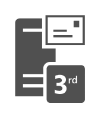

# 3rd Party Mail Server

## Definition

```
{
  _style: { 
    entity: 'sketch=0;pointerEvents=1;shadow=0;dashed=0;html=1;strokeColor=none;fillColor=#505050;labelPosition=center;verticalLabelPosition=bottom;verticalAlign=top;outlineConnect=0;align=center;shape=mxgraph.office.servers.3rd_party_mail_server;',
  },
  _original_width: 47,
  _original_height: 59,
}
```

## Usage

```
import { Component3rdPartyMailServer } from '@dinghy/standard-components-diagrams/officeServers'

<Component3rdPartyMailServer/>
```

## Preview


