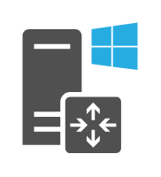

# Windows Router

## Definition

```
{
  _style: { 
    entity: 'sketch=0;pointerEvents=1;shadow=0;dashed=0;html=1;strokeColor=none;fillColor=#505050;labelPosition=center;verticalLabelPosition=bottom;verticalAlign=top;outlineConnect=0;align=center;shape=mxgraph.office.servers.windows_router;',
  },
  _width: 52,
  _height: 59,
}
```

## Usage

```
import { WindowsRouter } from '@diac/standard-components-diagrams/officeServers'

<WindowsRouter/>
```

## Preview


