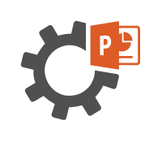

# PowerPoint Automation Services

## Definition

```
{
  _style: { 
    entity: 'sketch=0;pointerEvents=1;shadow=0;dashed=0;html=1;strokeColor=none;fillColor=#505050;labelPosition=center;verticalLabelPosition=bottom;verticalAlign=top;outlineConnect=0;align=center;shape=mxgraph.office.services.powerpoint_automation_services;',
  },
  _width: 59,
  _height: 49,
}
```

## Usage

```
import { PowerpointAutomationServices } from '@diac/standard-components-diagrams/officeServices'

<PowerpointAutomationServices/>
```

## Preview


