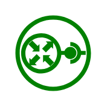

# Neutron RouterInterface

## Definition

```
{
  _style: 'fillColor=#008000;aspect=fixed;sketch=0;pointerEvents=1;shadow=0;dashed=0;html=1;strokeColor=none;labelPosition=center;verticalLabelPosition=bottom;outlineConnect=0;verticalAlign=top;align=center;shape=mxgraph.openstack.neutron_routerinterface;',
  _width: 50,
  _height: 50,
}
```

## Usage

```
import { NeutronRouterinterface } from '@reactiac/standard-components-diagrams/openstackGreen'

<NeutronRouterinterface/>
```

## Preview


