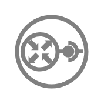

# Openstack Grey Entities

- [CinderVolume](./cinder-volume.md)  

- [CinderVolumeattachment](./cinder-volumeattachment.md)  

- [DesignateRecordset](./designate-recordset.md)  

- [DesignateZone](./designate-zone.md)  

- [HeatAutoscalinggroup](./heat-autoscalinggroup.md)  

- [HeatResourcegroup](./heat-resourcegroup.md)  

- [HeatScalingpolicy](./heat-scalingpolicy.md)  

- [NeutronFloatingip](./neutron-floatingip.md)  

- [NeutronFloatingipassociation](./neutron-floatingipassociation.md)  

- [NeutronNet](./neutron-net.md)  

- [NeutronPort](./neutron-port.md)  

- [NeutronRouter](./neutron-router.md)  

- [NeutronRouterinterface](./neutron-routerinterface.md)  

- [NeutronSecuritygroup](./neutron-securitygroup.md)  

- [NeutronSubnet](./neutron-subnet.md)  

- [NovaKeypair](./nova-keypair.md)  

- [NovaServer](./nova-server.md)  

- [SwiftContainer](./swift-container.md)  

