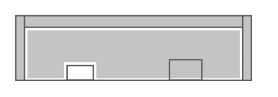

# Cisco 2921 Integrated Services Router

## Definition

```
{
  _style: 'shape=mxgraph.rack.cisco.cisco_2921_integrated_services_router;html=1;labelPosition=right;align=left;spacingLeft=15;dashed=0;shadow=0;fillColor=#ffffff;',
  _width: 161,
  _height: 45,
}
```

## Usage

```
import { Cisco2921IntegratedServicesRouter } from '@diac/standard-components-diagrams/rackCisco'

<Cisco2921IntegratedServicesRouter/>
```

## Preview


