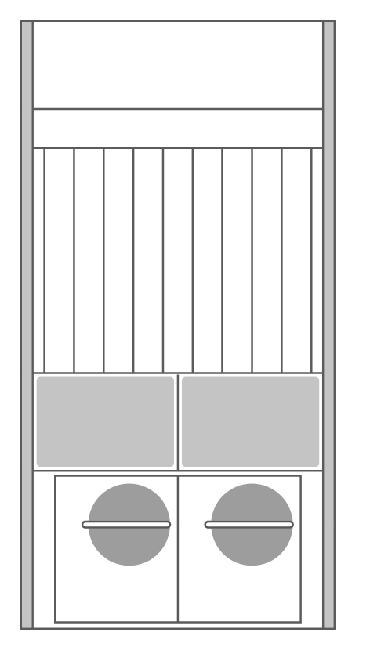

# Cisco 7609 Router

## Definition

```
{
  _style: 'shape=mxgraph.rack.cisco.cisco_7609_router;html=1;labelPosition=right;align=left;spacingLeft=15;dashed=0;shadow=0;fillColor=#ffffff;',
  _width: 161,
  _height: 311,
}
```

## Usage

```
import { Cisco7609Router } from '@diac/standard-components-diagrams/rackCisco'

<Cisco7609Router/>
```

## Preview


