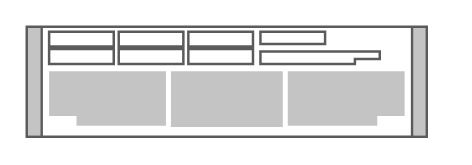

# Cisco 8340 Application-Oriented Networking Appliance

## Definition

```
{
  _style: { 
    entity: 'shape=mxgraph.rack.cisco.cisco_8340_application-oriented_networking_appliance;html=1;labelPosition=right;align=left;spacingLeft=15;dashed=0;shadow=0;fillColor=#ffffff;',
  },
  _original_width: 161,
  _original_height: 45,
}
```

## Usage

```
import { Cisco8340ApplicationOrientedNetworkingAppliance } from '@diac/standard-components-diagrams/rackCisco'

<Cisco8340ApplicationOrientedNetworkingAppliance/>
```

## Preview


