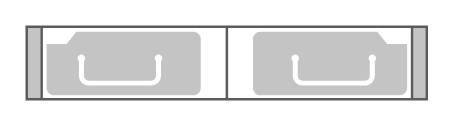

# Cisco ASA 5585-X Adaptive Security Appliance

## Definition

```
{
  _style: 'shape=mxgraph.rack.cisco.cisco_asa_5585-x_adaptive_security_appliance;html=1;labelPosition=right;align=left;spacingLeft=15;dashed=0;shadow=0;fillColor=#ffffff;',
  _width: 161,
  _height: 30,
}
```

## Usage

```
import { CiscoAsa5585XAdaptiveSecurityAppliance } from '@reactiac/standard-components-diagrams/rackCisco'

<CiscoAsa5585XAdaptiveSecurityAppliance/>
```

## Preview


