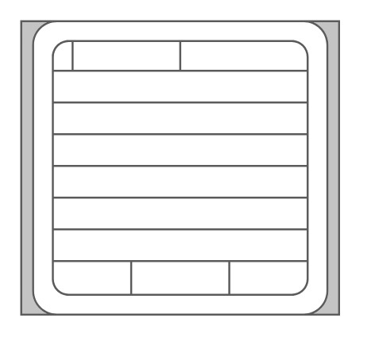

# Cisco ASR 9006

## Definition

```
{
  _style: 'shape=mxgraph.rack.cisco.cisco_asr_9006;html=1;labelPosition=right;align=left;spacingLeft=15;dashed=0;shadow=0;fillColor=#ffffff;',
  _width: 161,
  _height: 149,
}
```

## Usage

```
import { CiscoAsr9006 } from '@reactiac/standard-components-diagrams/rackCisco'

<CiscoAsr9006/>
```

## Preview


