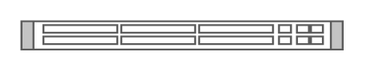

# Cisco Catalyst 4948 Switch

## Definition

```
{
  _style: { 
    entity: 'shape=mxgraph.rack.cisco.cisco_catalyst_4948_switch;html=1;labelPosition=right;align=left;spacingLeft=15;dashed=0;shadow=0;fillColor=#ffffff;',
  },
  _original_width: 161,
  _original_height: 15,
}
```

## Usage

```
import { CiscoCatalyst4948Switch } from '@dinghy/standard-components-diagrams/rackCisco'

<CiscoCatalyst4948Switch/>
```

## Preview


