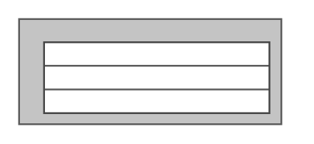

# Cisco Catalyst 6503-E Switch

## Definition

```
{
  _style: 'shape=mxgraph.rack.cisco.cisco_catalyst_6503-e_switch;html=1;labelPosition=right;align=left;spacingLeft=15;dashed=0;shadow=0;fillColor=#ffffff;',
  _width: 148,
  _height: 60,
}
```

## Usage

```
import { CiscoCatalyst6503ESwitch } from '@diac/standard-components-diagrams/rackCisco'

<CiscoCatalyst6503ESwitch/>
```

## Preview


