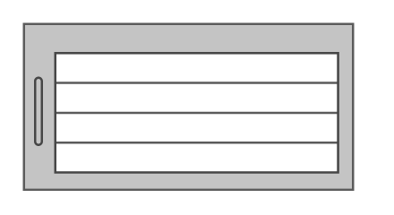

# Cisco Catalyst 6504-E Switch

## Definition

```
{
  _style: { 
    entity: 'shape=mxgraph.rack.cisco.cisco_catalyst_6504-e_switch;html=1;labelPosition=right;align=left;spacingLeft=15;dashed=0;shadow=0;fillColor=#ffffff;',
  },
  _width: 148,
  _height: 75,
}
```

## Usage

```
import { CiscoCatalyst6504ESwitch } from '@diac/standard-components-diagrams/rackCisco'

<CiscoCatalyst6504ESwitch/>
```

## Preview


