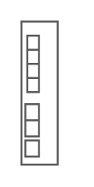

# Cisco Catalyst Blade Switch 3040 for Dell

## Definition

```
{
  _style: { 
    entity: 'shape=mxgraph.rack.cisco.cisco_catalyst_blade_switch_3040_for_dell;html=1;labelPosition=right;align=left;spacingLeft=15;dashed=0;shadow=0;fillColor=#ffffff;',
  },
  _original_width: 19,
  _original_height: 72,
}
```

## Usage

```
import { CiscoCatalystBladeSwitch3040ForDell } from '@diac/standard-components-diagrams/rackCisco'

<CiscoCatalystBladeSwitch3040ForDell/>
```

## Preview


