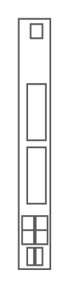

# Cisco Catalyst Blade Switch 3130 for Dell

## Definition

```
{
  _style: 'shape=mxgraph.rack.cisco.cisco_catalyst_blade_switch_3130_for_dell;html=1;labelPosition=right;align=left;spacingLeft=15;dashed=0;shadow=0;fillColor=#ffffff;',
  _width: 19,
  _height: 143,
}
```

## Usage

```
import { CiscoCatalystBladeSwitch3130ForDell } from '@diac/standard-components-diagrams/rackCisco'

<CiscoCatalystBladeSwitch3130ForDell/>
```

## Preview


