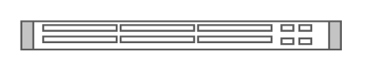

# Cisco Nexus 2248PQ 10GE Fabric Extender

## Definition

```
{
  _style: 'shape=mxgraph.rack.cisco.cisco_nexus_2248pq_10ge_fabric_extender;html=1;labelPosition=right;align=left;spacingLeft=15;dashed=0;shadow=0;fillColor=#ffffff;',
  _width: 161,
  _height: 15,
}
```

## Usage

```
import { CiscoNexus2248pq10geFabricExtender } from '@reactiac/standard-components-diagrams/rackCisco'

<CiscoNexus2248pq10geFabricExtender/>
```

## Preview


