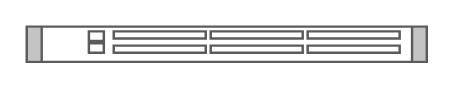

# Cisco Nexus 3548 Switch

## Definition

```
{
  _style: 'shape=mxgraph.rack.cisco.cisco_nexus_3548_switch;html=1;labelPosition=right;align=left;spacingLeft=15;dashed=0;shadow=0;fillColor=#ffffff;',
  _width: 161,
  _height: 15,
}
```

## Usage

```
import { CiscoNexus3548Switch } from '@reactiac/standard-components-diagrams/rackCisco'

<CiscoNexus3548Switch/>
```

## Preview


