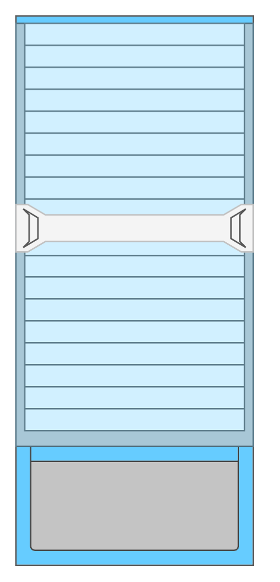

# Cisco Nexus 7000 18-Slot Switch Chassis

## Definition

```
{
  _style: { 
    entity: 'shape=mxgraph.rack.cisco.cisco_nexus_7000_18-slot_switch_chassis;html=1;labelPosition=right;align=left;spacingLeft=15;dashed=0;shadow=0;fillColor=#ffffff;',
  },
  _width: 161,
  _height: 371,
}
```

## Usage

```
import { CiscoNexus700018SlotSwitchChassis } from '@diac/standard-components-diagrams/rackCisco'

<CiscoNexus700018SlotSwitchChassis/>
```

## Preview


