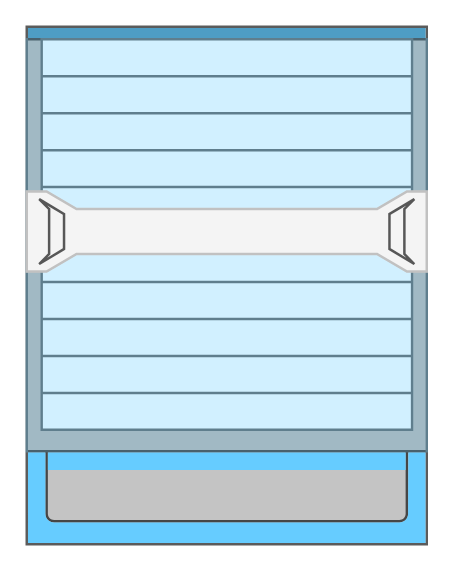

# Cisco Nexus 7000 9-Slot Switch Chassis

## Definition

```
{
  _style: 'shape=mxgraph.rack.cisco.cisco_nexus_7000_9-slot_switch_chassis;html=1;labelPosition=right;align=left;spacingLeft=15;dashed=0;shadow=0;fillColor=#ffffff;',
  _width: 161,
  _height: 208,
}
```

## Usage

```
import { CiscoNexus70009SlotSwitchChassis } from '@reactiac/standard-components-diagrams/rackCisco'

<CiscoNexus70009SlotSwitchChassis/>
```

## Preview


