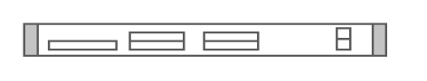

# Cisco ONS 15305 Multiservice Customer Access Platform

## Definition

```
{
  _style: 'shape=mxgraph.rack.cisco.cisco_ons_15305_multiservice_customer_access_platform;html=1;labelPosition=right;align=left;spacingLeft=15;dashed=0;shadow=0;fillColor=#ffffff;',
  _width: 161,
  _height: 15,
}
```

## Usage

```
import { CiscoOns15305MultiserviceCustomerAccessPlatform } from '@reactiac/standard-components-diagrams/rackCisco'

<CiscoOns15305MultiserviceCustomerAccessPlatform/>
```

## Preview


