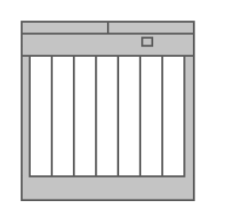

# Cisco ONS 15310-MA SDH Multiservice Platform

## Definition

```
{
  _style: 'shape=mxgraph.rack.cisco.cisco_ons_15310-ma_sdh_multiservice_platform;html=1;labelPosition=right;align=left;spacingLeft=15;dashed=0;shadow=0;fillColor=#ffffff;',
  _width: 86,
  _height: 89,
}
```

## Usage

```
import { CiscoOns15310MaSdhMultiservicePlatform } from '@diac/standard-components-diagrams/rackCisco'

<CiscoOns15310MaSdhMultiservicePlatform/>
```

## Preview


