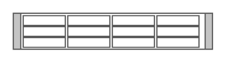

# Cisco Physical Security Multiservice Platform 2U

## Definition

```
{
  _style: 'shape=mxgraph.rack.cisco.cisco_physical_security_multiservice_platform_2u;html=1;labelPosition=right;align=left;spacingLeft=15;dashed=0;shadow=0;fillColor=#ffffff;',
  _width: 161,
  _height: 30,
}
```

## Usage

```
import { CiscoPhysicalSecurityMultiservicePlatform2u } from '@diac/standard-components-diagrams/rackCisco'

<CiscoPhysicalSecurityMultiservicePlatform2u/>
```

## Preview


