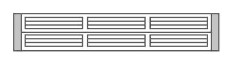

# Cisco UCS 6296UP Fabric Interconnect

## Definition

```
{
  _style: { 
    entity: 'shape=mxgraph.rack.cisco.cisco_ucs_6296up_fabric_interconnect;html=1;labelPosition=right;align=left;spacingLeft=15;dashed=0;shadow=0;fillColor=#ffffff;',
  },
  _width: 161,
  _height: 30,
}
```

## Usage

```
import { CiscoUcs6296upFabricInterconnect } from '@diac/standard-components-diagrams/rackCisco'

<CiscoUcs6296upFabricInterconnect/>
```

## Preview


