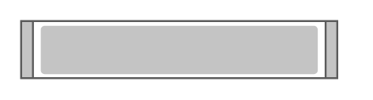

# Cisco Web Security Appliance S370

## Definition

```
{
  _style: 'shape=mxgraph.rack.cisco.cisco_web_security_appliance_s370;html=1;labelPosition=right;align=left;spacingLeft=15;dashed=0;shadow=0;fillColor=#ffffff;',
  _width: 161,
  _height: 30,
}
```

## Usage

```
import { CiscoWebSecurityApplianceS370 } from '@diac/standard-components-diagrams/rackCisco'

<CiscoWebSecurityApplianceS370/>
```

## Preview


