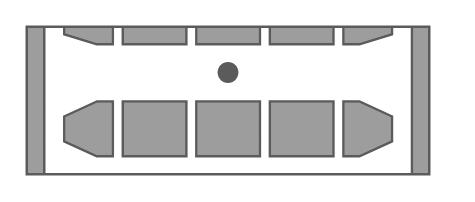
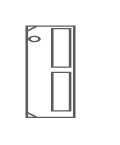
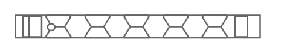
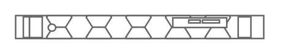
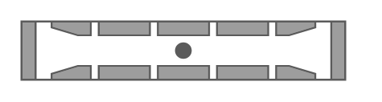

# Rack Dell Entities

- [PowerStrip](./power-strip.md)  

- [Poweredge1u](./poweredge-1u.md)  

- [Poweredge2u](./poweredge-2u.md)  

- [Poweredge4u](./poweredge-4u.md)  

- [Poweredge630](./poweredge-630.md)  

- [PoweredgeC4140](./poweredge-c4140.md)  

- [PoweredgeM1000eEnclosure](./poweredge-m1000e-enclosure.md)  

- [PoweredgeM420](./poweredge-m420.md)  

- [PoweredgeM520](./poweredge-m520.md)  

- [PoweredgeM610x](./poweredge-m610x.md)  

- [PoweredgeM620](./poweredge-m620.md)  

- [PoweredgeM820](./poweredge-m820.md)  

- [PoweredgeM915](./poweredge-m915.md)  

- [PoweredgeR240](./poweredge-r240.md)  

- [PoweredgeR340](./poweredge-r340.md)  

- [PoweredgeR440](./poweredge-r440.md)  

- [PoweredgeR540](./poweredge-r540.md)  

- [PoweredgeR640](./poweredge-r640.md)  

- [PoweredgeR6415](./poweredge-r6415.md)  

- [PoweredgeR6515](./poweredge-r6515.md)  

- [PoweredgeR6525](./poweredge-r6525.md)  

- [PoweredgeR730](./poweredge-r730.md)  

- [PoweredgeR730xd](./poweredge-r730xd.md)  

- [PoweredgeR740](./poweredge-r740.md)  

- [PoweredgeR740xd](./poweredge-r740xd.md)  

- [PoweredgeR740xd2](./poweredge-r740xd2.md)  

- [PoweredgeR7415](./poweredge-r7415.md)  

- [PoweredgeR7425](./poweredge-r7425.md)  

- [PoweredgeR7515](./poweredge-r7515.md)  

- [PoweredgeR840](./poweredge-r840.md)  

- [PoweredgeR940](./poweredge-r940.md)  

- [PoweredgeXr2](./poweredge-xr2.md)  

