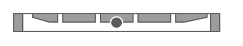

# PowerEdge 1U

## Definition

```
{
  _style: { 
    entity: 'strokeColor=#666666;html=1;labelPosition=right;align=left;spacingLeft=15;shadow=0;dashed=0;outlineConnect=0;shape=mxgraph.rack.dell.dell_poweredge_1u;',
  },
  _original_width: 162,
  _original_height: 15,
}
```

## Usage

```
import { Poweredge1u } from '@dinghy/standard-components-diagrams/rackDell'

<Poweredge1u/>
```

## Preview


