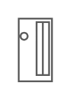

# PowerEdge M420

## Definition

```
{
  _style: { 
    entity: 'strokeColor=#666666;html=1;labelPosition=right;align=left;spacingLeft=15;shadow=0;dashed=0;outlineConnect=0;shape=mxgraph.rack.dell.poweredge_m420;',
  },
  _original_width: 20,
  _original_height: 37,
}
```

## Usage

```
import { PoweredgeM420 } from '@dinghy/standard-components-diagrams/rackDell'

<PoweredgeM420/>
```

## Preview


