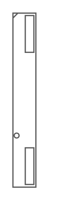

# PowerEdge M915

## Definition

```
{
  _style: 'strokeColor=#666666;html=1;labelPosition=right;align=left;spacingLeft=15;shadow=0;dashed=0;outlineConnect=0;shape=mxgraph.rack.dell.poweredge_m915;',
  _width: 20,
  _height: 143,
}
```

## Usage

```
import { PoweredgeM915 } from '@reactiac/standard-components-diagrams/rackDell'

<PoweredgeM915/>
```

## Preview


