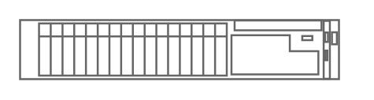

# PowerEdge R740

## Definition

```
{
  _style: 'strokeColor=#666666;html=1;labelPosition=right;align=left;spacingLeft=15;shadow=0;dashed=0;outlineConnect=0;shape=mxgraph.rack.dell.poweredge_r740;',
  _width: 162,
  _height: 30,
}
```

## Usage

```
import { PoweredgeR740 } from '@diac/standard-components-diagrams/rackDell'

<PoweredgeR740/>
```

## Preview


