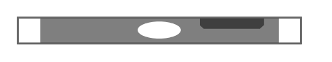

# PowerEdge XR2

## Definition

```
{
  _style: { 
    entity: 'strokeColor=#666666;html=1;labelPosition=right;align=left;spacingLeft=15;shadow=0;dashed=0;outlineConnect=0;shape=mxgraph.rack.dell.poweredge_xr2;',
  },
  _original_width: 162,
  _original_height: 15,
}
```

## Usage

```
import { PoweredgeXr2 } from '@diac/standard-components-diagrams/rackDell'

<PoweredgeXr2/>
```

## Preview


