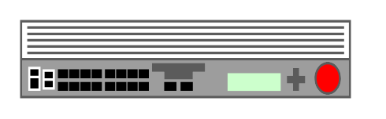

# BIG-IP 10x00

## Definition

```
{
  _style: { 
    entity: 'strokeColor=#666666;html=1;labelPosition=right;align=left;spacingLeft=15;shadow=0;dashed=0;outlineConnect=0;shape=mxgraph.rack.f5.big_ip_10x00;',
  },
  _original_width: 168,
  _original_height: 40,
}
```

## Usage

```
import { BigIp10x00 } from '@dinghy/standard-components-diagrams/rackF5'

<BigIp10x00/>
```

## Preview


