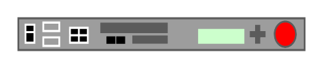

# BIG-IP 1600

## Definition

```
{
  _style: 'strokeColor=#666666;html=1;labelPosition=right;align=left;spacingLeft=15;shadow=0;dashed=0;outlineConnect=0;shape=mxgraph.rack.f5.big_ip_1600;',
  _width: 168,
  _height: 20,
}
```

## Usage

```
import { BigIp1600 } from '@reactiac/standard-components-diagrams/rackF5'

<BigIp1600/>
```

## Preview


