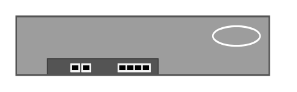
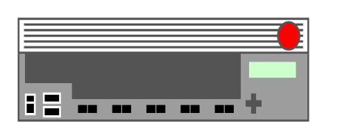
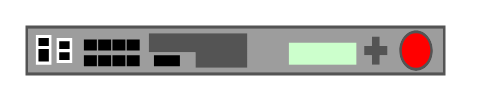
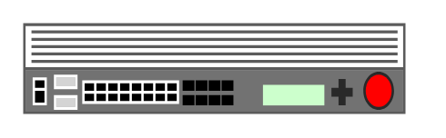

# Rack F5 Entities

- [Arx1000](./arx-1000.md)  

- [Arx1500](./arx-1500.md)  

- [Arx2000](./arx-2000.md)  

- [Arx2500](./arx-2500.md)  

- [Arx4000](./arx-4000.md)  

- [Arx500](./arx-500.md)  

- [Arx5000](./arx-5000.md)  

- [Arx6000](./arx-6000.md)  

- [BigIp10x00](./big-ip-10x00.md)  

- [BigIp110x0](./big-ip-110x0.md)  

- [BigIp1600](./big-ip-1600.md)  

- [BigIp2x00](./big-ip-2x00.md)  

- [BigIp3600](./big-ip-3600.md)  

- [BigIp3900](./big-ip-3900.md)  

- [BigIp4x00](./big-ip-4x00.md)  

- [BigIp5x00](./big-ip-5x00.md)  

- [BigIp6900](./big-ip-6900.md)  

- [BigIp7x00](./big-ip-7x00.md)  

- [BigIp89x0](./big-ip-89x0.md)  

- [Em4000](./em-4000.md)  

- [Firepass1200](./firepass-1200.md)  

- [Firepass4100](./firepass-4100.md)  

- [Viprion2400](./viprion-2400.md)  

- [Viprion4400](./viprion-4400.md)  

- [Viprion4800](./viprion-4800.md)  

