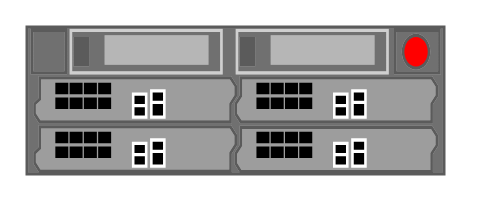

# VIPRION 2400

## Definition

```
{
  _style: 'strokeColor=#666666;html=1;labelPosition=right;align=left;spacingLeft=15;shadow=0;dashed=0;outlineConnect=0;shape=mxgraph.rack.f5.viprion_2400;',
  _width: 168,
  _height: 60,
}
```

## Usage

```
import { Viprion2400 } from '@reactiac/standard-components-diagrams/rackF5'

<Viprion2400/>
```

## Preview


