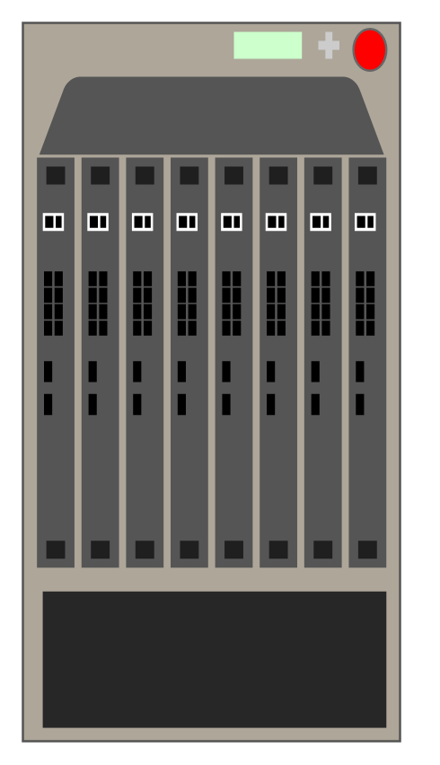

# VIPRION 4800

## Definition

```
{
  _style: { 
    entity: 'strokeColor=#666666;html=1;labelPosition=right;align=left;spacingLeft=15;shadow=0;dashed=0;outlineConnect=0;shape=mxgraph.rack.f5.viprion_4800;',
  },
  _width: 168,
  _height: 320,
}
```

## Usage

```
import { Viprion4800 } from '@diac/standard-components-diagrams/rackF5'

<Viprion4800/>
```

## Preview


